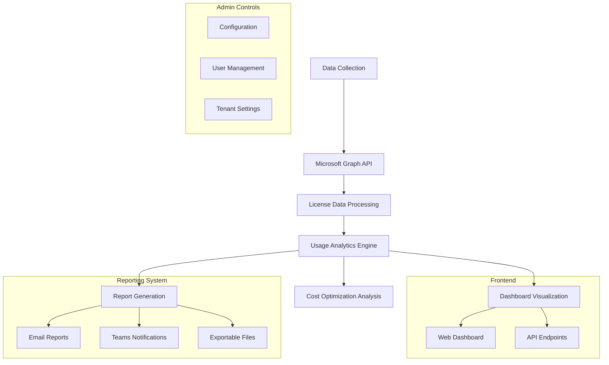

# Microsoft 365 License Tracker

<div align="center">


[](https://www.python.org/)
[](https://docs.microsoft.com/en-us/graph/)
[](https://flask.palletsprojects.com/)
[](https://www.chartjs.org/)
[](LICENSE)

</div>

## Overview

Microsoft 365 License Tracker is a comprehensive solution for monitoring, analyzing, and optimizing your organization's M365 license usage. With real-time dashboards, cost analytics, and automated reporting, this tool helps IT administrators identify potential savings of up to 15% on licensing costs while ensuring optimal resource allocation.

### Key Benefits

- **Reduce Licensing Costs**: Identify unused or underutilized licenses
- **Optimize Resource Allocation**: Ensure the right licenses for the right users
- **Enhance Visibility**: Real-time dashboards and comprehensive reporting
- **Automate Compliance**: Track license assignments and usage patterns
- **Data-Driven Decisions**: Make informed licensing decisions based on actual usage

## Features

<table>
  <tr>
    <td width="50%">
      <h3>Real-time Dashboard</h3>
      <ul>
        <li>Interactive usage visualizations</li>
        <li>License allocation breakdowns</li>
        <li>Trend analysis over time</li>
        <li>Department-level insights</li>
      </ul>
    </td>
    <td width="50%">
      <h3>Cost Optimization</h3>
      <ul>
        <li>Unused license identification</li>
        <li>Potential savings calculator</li>
        <li>License right-sizing recommendations</li>
        <li>Budget vs. actual comparisons</li>
      </ul>
    </td>
  </tr>
  <tr>
    <td>
      <h3>Multi-tenant Support</h3>
      <ul>
        <li>Manage multiple M365 tenants</li>
        <li>Cross-tenant reporting</li>
        <li>Consolidated license management</li>
        <li>Role-based access controls</li>
      </ul>
    </td>
    <td>
      <h3>Automated Reporting</h3>
      <ul>
        <li>Scheduled email reports</li>
        <li>Teams channel notifications</li>
        <li>Custom report templates</li>
        <li>Export to multiple formats</li>
      </ul>
    </td>
  </tr>
</table>

## Screenshots & Demo

<div align="center">

### License Usage Dashboard


### Cost Analysis Report


[View Live Demo](https://jaquanwatson.github.io/license-tracker-demo.html)

</div>

## Technical Architecture



## Prerequisites

- Python 3.8 or higher
- Microsoft Graph API permissions:
  - `User.Read.All`
  - `Organization.Read.All`
  - `Directory.Read.All`
- Web server for hosting (optional)

## Installation & Setup

### Quick Setup

```bash
# Clone the repository
git clone https://github.com/jaquanwatson/m365-license-tracker.git
cd m365-license-tracker

# Install dependencies
pip install -r requirements.txt

# Configure authentication
cp config.example.json config.json
# Edit config.json with your Azure app details

# Run the application
python app.py

# Access dashboard
# Open http://localhost:5000 in your browser
```

### Docker Deployment

```bash
# Build Docker image
docker build -t m365-license-tracker .

# Run container
docker run -p 5000:5000 m365-license-tracker
```

### Azure Container Instances

```bash
az container create \
  --resource-group myResourceGroup \
  --name license-tracker \
  --image m365-license-tracker:latest \
  --ports 5000
```

## Configuration

```json
{
  "azure": {
    "client_id": "your-client-id",
    "client_secret": "your-client-secret",
    "tenant_id": "your-tenant-id"
  },
  "reporting": {
    "email_enabled": true,
    "email_recipients": ["admin@company.com"],
    "report_frequency": "weekly"
  },
  "thresholds": {
    "unused_days": 30,
    "cost_alert_threshold": 1000
  },
  "display": {
    "currency_symbol": "$",
    "default_chart_type": "bar",
    "theme": "light"
  }
}
```

## Dashboard Features

### License Overview

- Total licenses by type
- Active vs. unused licenses
- Monthly cost breakdown
- Usage trends over time

### Cost Analysis

- Unused license identification
- Potential savings calculations
- Cost per department/user
- Budget vs. actual spending

### User Analytics

- Individual user license assignments
- Last activity tracking
- License utilization rates
- Compliance status

## API Endpoints

```python
# Get license summary
GET /api/licenses/summary

# Get user details
GET /api/users/{user_id}/licenses

# Get cost analysis
GET /api/costs/analysis

# Generate report
POST /api/reports/generate
```

## Sample Reports

### Weekly License Report

```
Microsoft 365 License Report - Week of Jan 8, 2025
================================================

Summary:
- Total Licenses: 1,247
- Active Users: 1,089 (87%)
- Unused Licenses: 158
- Monthly Cost: $18,705
- Potential Savings: $2,370/month

Top Unused License Types:
1. Power BI Pro: 45 licenses ($450/month)
2. Project Plan 3: 32 licenses ($960/month)
3. Visio Plan 2: 28 licenses ($420/month)

Recommendations:
- Remove 45 unused Power BI Pro licenses
- Consider downgrading 15 E5 to E3 licenses
- Review Project Plan 3 assignments
```

## Security & Compliance

- **Secure Authentication**: Uses Azure AD app registration
- **Least Privilege**: Minimal required permissions
- **Data Privacy**: No sensitive data stored locally
- **Audit Logging**: All actions logged for compliance
- **Encryption**: All API communications encrypted

## Advanced Features

### Custom Dashboards

```python
# Create department-specific dashboard
@app.route('/dashboard/<department>')
def department_dashboard(department):
    dept_data = license_manager.get_department_data(department)
    return render_template('department.html', data=dept_data)
```

### Integration Options

- **Power BI**: Export data for advanced analytics
- **ServiceNow**: Create tickets for license changes
- **Microsoft Teams**: Interactive license reports
- **Azure Automation**: Scheduled license optimization

## Contributing

Contributions are welcome! Please read our [Contributing Guide](CONTRIBUTING.md) for details.

1. Fork the repository
2. Create a feature branch
3. Make your changes
4. Add tests if applicable
5. Submit a pull request

## License

This project is licensed under the MIT License - see the [LICENSE](LICENSE) file for details.

## Author & Support

**Jaquan Watson** - Cloud & Systems Engineer

- Email: jqwatson96@gmail.com
- LinkedIn: [jaquanwatson](https://linkedin.com/in/jaquanwatson)
- GitHub: [@jaquanwatson](https://github.com/jaquanwatson)

### Acknowledgments

- Microsoft Graph API team
- Python Flask community
- Chart.js for visualization components

### Success Story

> "Using the M365 License Tracker, we identified over $45,000 in annual savings by optimizing our license assignments and removing unused subscriptions. The real-time dashboard has become an essential tool for our IT department." - Enterprise IT Director

---

<div align="center">

⭐ **Found this useful? Give it a star!** ⭐

Built with ❤️ for better IT resource management

</div>